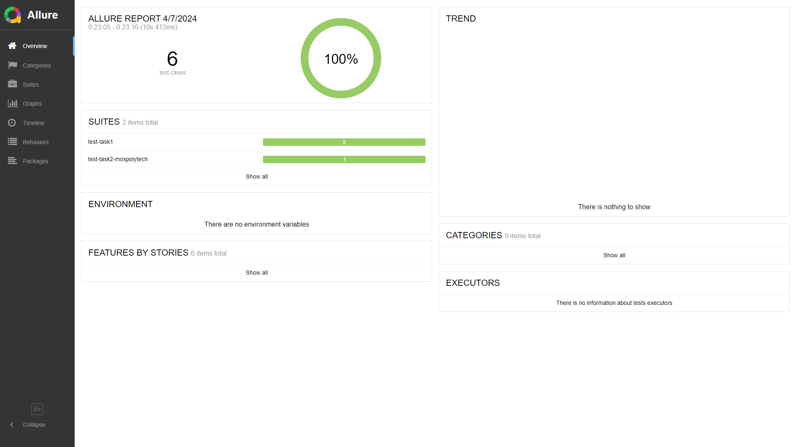
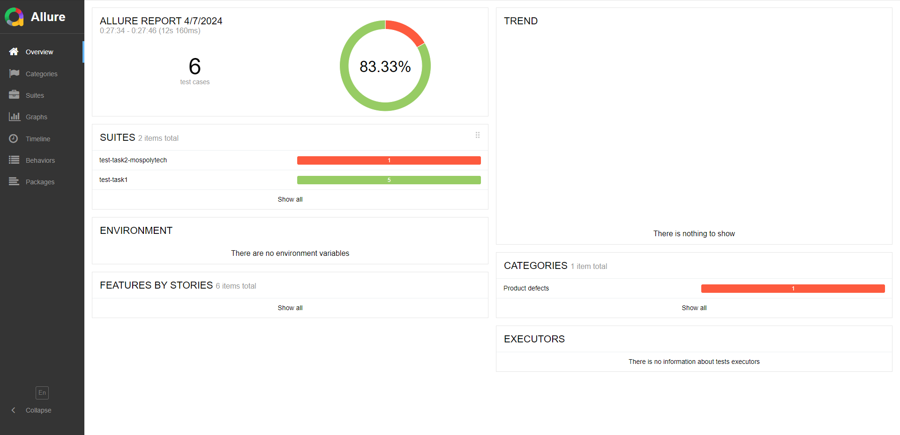
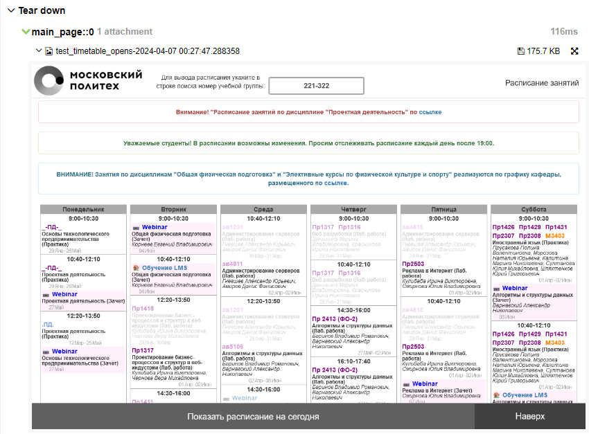

# autotesting-labs


## Usage

Create venv and install dependencies:

- Windows:
    ```bash
    python -m virtualenv --python=3.12 venv
    ./venv/Scripts/activate
    pip install poetry
    poetry install
    ```
  
- Linux/MacOS:
    ```bash
    python -m virtualenv --python=3.12 venv
    source venv/bin/activate
    pip install poetry
    poetry install
    ```

Run tests:

```bash
pytest --driver Firefox -n <NUM_OF_WORKERS>
```

Example: 

```bash
pytest --driver Firefox -n 5 --alluredir=./allure-reports
allure serve ./allure-reports
```

## Allure reports



When test fails:



